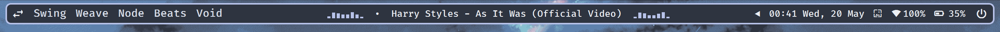
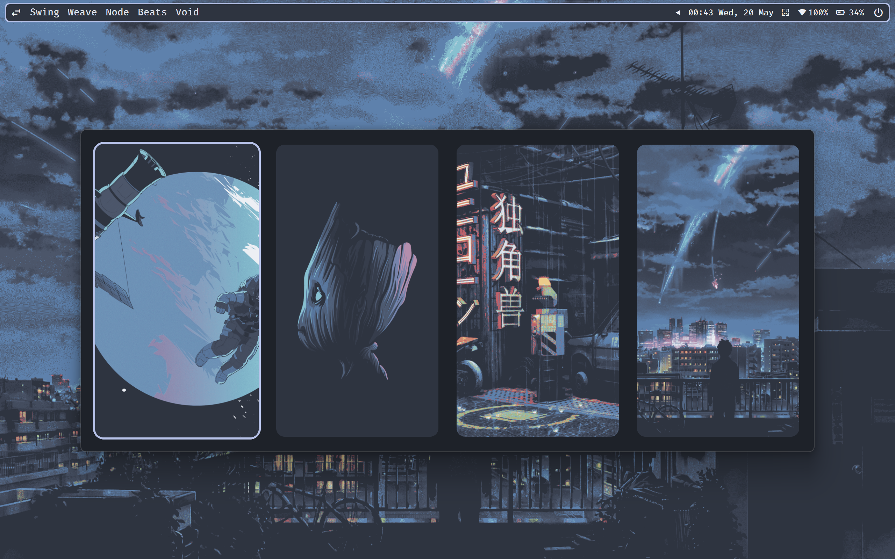
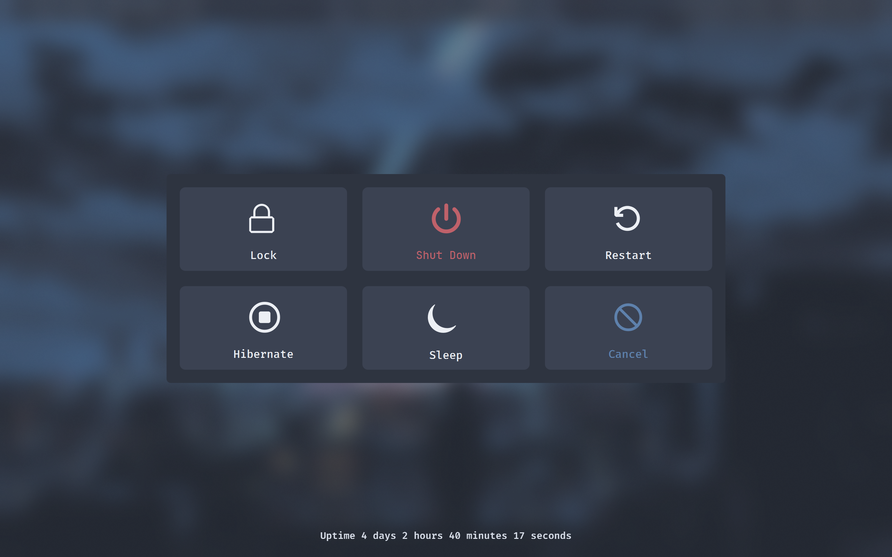

# YASB Nord Minimal

A clean, minimal [Nord](https://www.nordtheme.com/) themed configuration for [YASB](https://github.com/amnweb/yasb) (Yet Another Status Bar) for Windows.

## Screenshots

| Desktop | Media |
|---------|-------|
|  |  |

| System Tray | Calendar |
|-------------|----------|
|  |  |

| Wallpaper Picker | Power Menu |
|------------------|------------|
|  |  |

## Features

- **GlazeWM** workspace and tiling direction indicators
- **Cava** audio visualizer
- **Media** player controls with popup menu
- **System tray**
- **Clock** with calendar popup
- **Wi-Fi** monitor
- **Battery** indicator with percentage
- **Wallpaper** gallery picker
- **Power menu** with sleep, hibernate, lock, restart, and shutdown options

## Prerequisites

- [GlazeWM](https://github.com/glzr-io/glazewm) — tiling window manager (required for workspace and tiling direction widgets)
- [Cava](https://github.com/karlstav/cava) — audio visualizer (required for the cava widget)

## Usage

1. Install [YASB](https://github.com/amnweb/yasb).
2. Copy `config.yaml` and `styles.css` to your YASB config directory (typically `%USERPROFILE%\.yasb\`).
3. Restart YASB.

> **Note:** The wallpaper picker `image_path` in `config.yaml` points to `D:\CozyPixels Nord\Picked`. Update it to your own wallpaper directory.

## Fonts

These fonts are required for the bar to render correctly:

- [JetBrains Mono Nerd Font](https://www.nerdfonts.com/font-downloads) — used for icons (power menu, media controls, etc.)
- [Fira Code](https://github.com/tonsky/FiraCode) — used for all UI text
